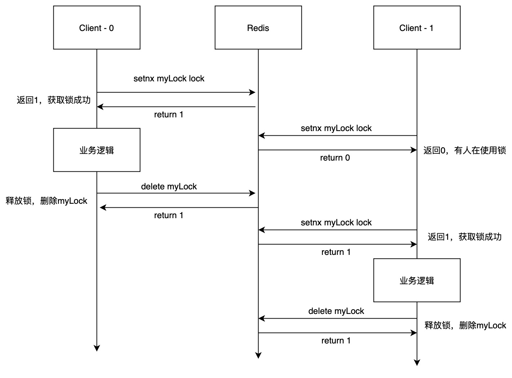
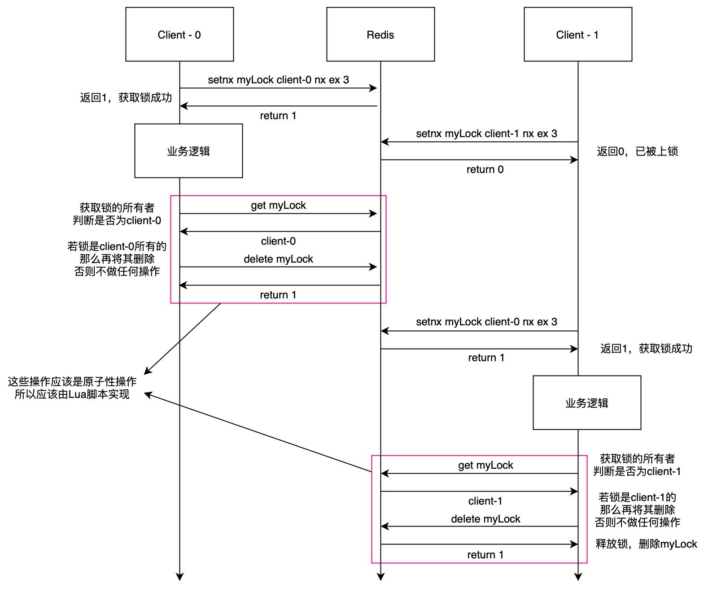

## Redis-Lock

简单实现一下基于Redis的分布式锁

## 分布式锁的特性

互斥性、安全性、对称性、可靠性

## 常用实现方式

### 最简化版本

直接使用setnx命令（setnx key value），如果设置成功则返回1，若Redis中有值，则不做修改并返回0。根据这个特性即可实现简单的分布式锁

### 支持过期时间

上述版本有一个问题，若Client-0在进行业务逻辑期间挂掉了，那么这个锁将永远得不到释放，因此解决方案是在获取锁时设置一个过期时间。

若setnx和expire分开执行，则不具备原子性，还是会有有可能释放不了锁，可以使用**set key value nx ex secound**命令来设置过期时间

### 加上owner

加上了过期时间还不够完善，若Client-0获取了锁，但是其业务逻辑本身耗时较长，超过了锁的过期时间，而正巧Client-1从Redis中获取了锁，开始了它的业务逻辑，Client-0在这时业务结束，准备释放锁，但释放的确是Client-1的锁，这显然不是我们想要的结果。

解决方案就是在锁上添加一个所有者。每次释放锁的时候都进行一次判断：判断该锁是否为我所有。

若在获取锁的所有者的时候，但删除的时候恰好因为锁的过期，而此时可能锁已经变成了别人的锁，这时若给它删除，删掉的是其他人的锁，依旧不是自己的。

因此在判断锁的所有者和删除锁的这些步骤应该是原子化的，但Redis没有直接提供这种场景的操作，因此我们可以借用Lua脚本来实现原子化操作。